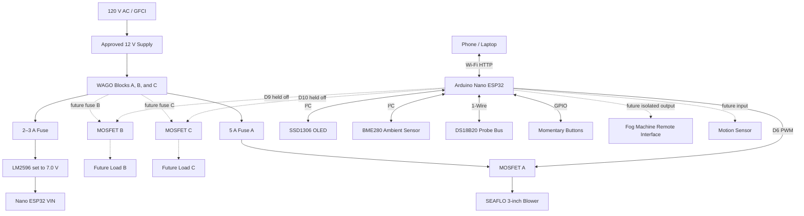

# 2. System Architecture



The tested baseline uses the external ALITOVE 12 V adapter. A future cabinet-rated DIN supply can replace it without changing the low-voltage map, provided its mains input is installed in a separate covered compartment. All five `0V` WAGOs form one common reference; the three MOSFET power inputs, MOSFET logic grounds, LM2596, Nano, and sensors connect to that shared reference as documented in the slot map.

## Operating modes

### Manual

The user sets blower speed from the web interface or physical buttons.

### Automatic

The controller adjusts blower speed within configured limits based on:

- Cooler temperature
- Fog outlet temperature
- Ambient temperature
- Optional future fog-machine state

Version 1 uses conservative rule-based logic rather than closed-loop airflow control.

### Test

Runs the blower at a selected percentage for bench testing without requiring sensors.

### Safe state

The blower defaults off after reset. A missing temperature sensor does not automatically start the blower.

## Network model

The firmware first attempts to join configured Wi-Fi. If that fails, it creates a temporary setup access point:

```text
SSID: FogController-Setup
```

The web dashboard is available at the device IP. mDNS advertises:

```text
http://fogbox.local
```

OTA updates require local network access and should be protected with a strong password.
