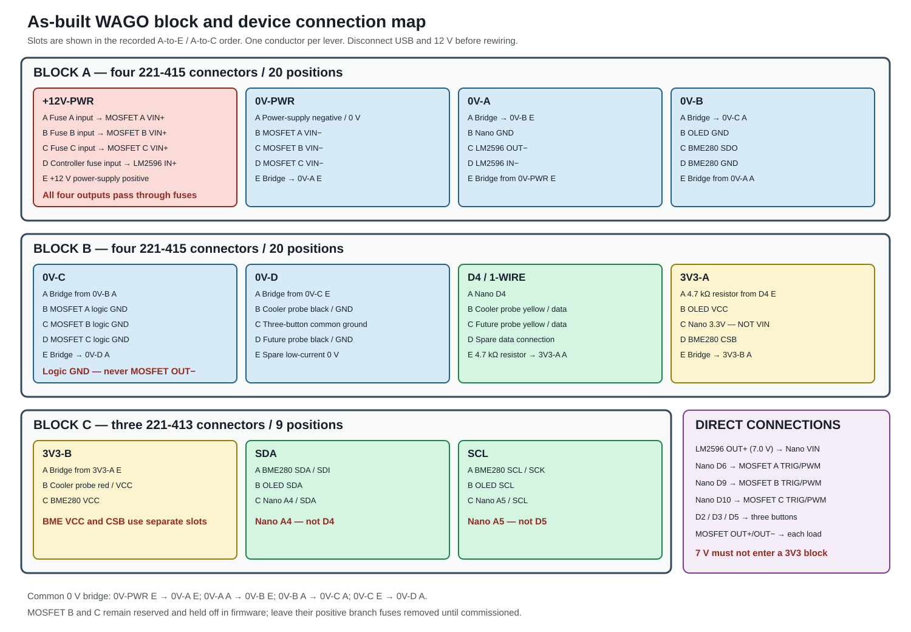

# 3. Wiring and Pin Map

This document records the permanent three-MOSFET controller wiring. It supersedes the earlier breadboard layout.

## Safety and wiring rules

- Disconnect USB and 12 V power before moving any wire.
- Each WAGO contains one electrical net only. Never mix 12 V, 7 V, 3.3 V, 0 V, or signal wiring in one connector.
- Use one conductor per WAGO lever position.
- The LM2596 output is approximately 7.0 V and connects only to Nano `VIN` and common 0 V. It must never enter either `3V3` WAGO.
- Fuse every +12 V branch after `+12V-PWR` and before the device. Do not fuse 0 V returns.
- A MOSFET module's small logic `GND` is not its load `OUT-` terminal. Connect load negative directly to that channel's `OUT-`.
- Use the Nano pin names printed on the terminal adapter, not raw ESP32-S3 GPIO numbers.

Use 16 AWG for the 12 V source, 0 V distribution bridges, and motor-power branches. Use 22–24 AWG for sensor, button, and logic wiring. Size every future branch conductor and fuse for the load's measured continuous and startup/stall current.

## Nano ESP32 pin assignments

| Function | Nano pin | State/notes |
|---|---|---|
| Start/Stop button | D2 | Normally-open button to 0 V; internal pull-up |
| Mode button | D3 | Normally-open button to 0 V; internal pull-up |
| DS18B20 bus | D4 | One 4.7 kΩ pull-up to 3.3 V for the entire bus |
| Test button | D5 | Normally-open button to 0 V; internal pull-up |
| MOSFET A PWM | D6 | Active blower output |
| Future isolated fog trigger | D7 | Reserved; never connect directly to a fog-machine remote circuit |
| Future PIR motion | D8 | Reserved input |
| MOSFET B PWM | D9 | Reserved; firmware holds LOW/off |
| MOSFET C PWM | D10 | Reserved; firmware holds LOW/off |
| I²C SDA | A4 / SDA | OLED and BME280 shared bus |
| I²C SCL | A5 / SCL | OLED and BME280 shared bus |
| Regulated sensor supply | 3.3V | Source for `3V3-A`; this is not `VIN` |
| Controller supply input | VIN | LM2596 `OUT+`, adjusted to approximately 7.0 V |
| Common reference | GND | Connects to `0V-A` |

MOSFETs B and C have safe-state pins but no web controls or operating logic. Leave their branch fuses removed until their loads, fuse sizes, output behavior, and emergency-stop behavior are defined and tested. Fit a 10 kΩ pull-down from each `TRIG/PWM` input to common 0 V unless the module documentation confirms one is already installed.

## As-built WAGO layout



The installation uses eight five-position WAGO 221-415 connectors and three three-position WAGO 221-413 connectors:

| Physical group | Connectors |
|---|---|
| Block A — 20 positions | `+12V-PWR`, `0V-PWR`, `0V-A`, `0V-B` — 4 × 221-415 |
| Block B — 20 positions | `0V-C`, `0V-D`, `D4 / 1-WIRE`, `3V3-A` — 4 × 221-415 |
| Block C — 9 positions | `3V3-B`, `SDA`, `SCL` — 3 × 221-413 |

Slots A–E or A–C below follow the physical order recorded during assembly. Label each connector and both ends of every conductor.

### Block A — four 221-415 connectors

#### `+12V-PWR`

| Slot | Connection |
|---|---|
| A | MOSFET A branch-fuse input; fuse output → MOSFET A `VIN+` |
| B | MOSFET B branch-fuse input; fuse output → MOSFET B `VIN+` |
| C | MOSFET C branch-fuse input; fuse output → MOSFET C `VIN+` |
| D | Controller-fuse input; fuse output → LM2596 `IN+` |
| E | +12 V from power supply |

Use the tested 5 A fuse for MOSFET A and a 2–3 A controller fuse. Leave B and C fuses removed until those loads are commissioned.

#### `0V-PWR`

| Slot | Connection |
|---|---|
| A | 0 V / negative from 12 V power supply |
| B | MOSFET A `VIN-` |
| C | MOSFET B `VIN-` |
| D | MOSFET C `VIN-` |
| E | 16 AWG bridge → `0V-A`, Slot E |

#### `0V-A`

| Slot | Connection |
|---|---|
| A | 16 AWG bridge → `0V-B`, Slot E |
| B | Nano ESP32 `GND` |
| C | LM2596 `OUT-` |
| D | LM2596 `IN-` |
| E | 16 AWG bridge from `0V-PWR`, Slot E |

#### `0V-B`

| Slot | Connection |
|---|---|
| A | 16 AWG bridge → `0V-C`, Slot A |
| B | OLED `GND` |
| C | BME280 `SDO` — selects I²C address `0x76` |
| D | BME280 `GND` |
| E | 16 AWG bridge from `0V-A`, Slot A |

### Block B — four 221-415 connectors

#### `0V-C`

| Slot | Connection |
|---|---|
| A | 16 AWG bridge from `0V-B`, Slot A |
| B | MOSFET A small logic `GND` |
| C | MOSFET B small logic `GND` |
| D | MOSFET C small logic `GND` |
| E | 16 AWG bridge → `0V-D`, Slot A |

Do not connect any MOSFET `OUT-` terminal to these slots. Each `OUT-` goes directly to its controlled load.

#### `0V-D`

| Slot | Connection |
|---|---|
| A | 16 AWG bridge from `0V-C`, Slot E |
| B | Cooler DS18B20 black wire / GND |
| C | Common ground daisy-chain for Start, Mode, and Test buttons |
| D | Reserved for second DS18B20 black wire / GND |
| E | Spare low-current 0 V connection |

#### `D4 / 1-WIRE`

| Slot | Connection |
|---|---|
| A | Nano ESP32 `D4` |
| B | Cooler DS18B20 yellow data wire |
| C | Reserved for second DS18B20 yellow data wire |
| D | Spare 1-Wire data connection |
| E | One end of 4.7 kΩ pull-up resistor; other end → `3V3-A`, Slot A |

Only one 4.7 kΩ pull-up resistor is used for the entire DS18B20 bus. It bridges data to 3.3 V; it is not installed in series with the probe.

#### `3V3-A`

| Slot | Connection |
|---|---|
| A | 4.7 kΩ resistor from `D4 / 1-WIRE`, Slot E |
| B | OLED `VCC` |
| C | Nano ESP32 `3.3V` — **not Nano VIN** |
| D | BME280 `CSB` — selects I²C mode |
| E | Bridge → `3V3-B`, Slot A |

### Block C — three 221-413 connectors

#### `3V3-B`

| Slot | Connection |
|---|---|
| A | Bridge from `3V3-A`, Slot E |
| B | Cooler DS18B20 red wire / VCC |
| C | BME280 `VCC` |

The BME280 `VCC` and `CSB` use separate WAGO positions; do not put two conductors under one lever.

#### `SDA`

| Slot | Connection |
|---|---|
| A | BME280 `SDA/SDI` |
| B | OLED `SDA` |
| C | Nano ESP32 `A4/SDA` — **not D4** |

#### `SCL`

| Slot | Connection |
|---|---|
| A | BME280 `SCL/SCK` |
| B | OLED `SCL` |
| C | Nano ESP32 `A5/SCL` — **not D5** |

## Direct connections outside the WAGO blocks

| From | To |
|---|---|
| LM2596 `OUT+` at approximately 7.0 V | Nano ESP32 `VIN` |
| Nano D6 | MOSFET A `TRIG/PWM` |
| Nano D9 | MOSFET B `TRIG/PWM` |
| Nano D10 | MOSFET C `TRIG/PWM` |
| Nano D2 | Start/Stop button; other side → `0V-D`, Slot C ground chain |
| Nano D3 | Mode button; other side → `0V-D`, Slot C ground chain |
| Nano D5 | Test button; other side → `0V-D`, Slot C ground chain |
| MOSFET A `OUT+` / `OUT-` | Blower red / black |
| MOSFET B `OUT+` / `OUT-` | Future load B positive / negative |
| MOSFET C `OUT+` / `OUT-` | Future load C positive / negative |

## Power paths

Set and verify the LM2596 output at 6.8–7.2 V with a multimeter before connecting the Nano.

```text
+12 V supply +
  └── +12V-PWR
      ├── fuse A ────────── MOSFET A VIN+ ── OUT+/OUT- ── blower
      ├── future fuse B ── MOSFET B VIN+ ── OUT+/OUT- ── future load B
      ├── future fuse C ── MOSFET C VIN+ ── OUT+/OUT- ── future load C
      └── controller fuse ─ LM2596 IN+ ── OUT+ at 7.0 V ── Nano VIN

12 V supply -
  └── 0V-PWR ══ 0V-A ══ 0V-B ══ 0V-C ══ 0V-D
      ├── MOSFET A/B/C VIN-
      ├── LM2596 IN-/OUT- and Nano GND
      ├── OLED and BME280 ground
      └── MOSFET logic grounds, probes, and buttons

Nano 3.3V ── 3V3-A ══ 3V3-B ── OLED, BME280, and DS18B20
Nano D4 ──── D4 / 1-WIRE ───── probe data and 4.7 kΩ pull-up
Nano A4 ──── SDA ────────────── OLED and BME280
Nano A5 ──── SCL ────────────── OLED and BME280
Nano D6/D9/D10 ──────────────── MOSFET A/B/C TRIG/PWM
```

## Sensor notes

The six-pin BME280 is wired in I²C mode: `CSB` to 3.3 V and `SDO` to 0 V. This selects address `0x76`; the firmware also probes `0x77`. Preserve this tested configuration.

One DS18B20 probe is sufficient for testing. With one working probe, `coolerTempF` should have a value while `outletTempF` may remain `null`. Add the second probe to the reserved red, black, and yellow slots and record both sensor addresses before final placement.

## Inductive-load suppression

If a MOSFET module does not clearly include suitable inductive-load suppression, add a correctly sized flyback diode or TVS device based on the specific motor and module documentation. Do not install a suppression component with guessed polarity or rating.
