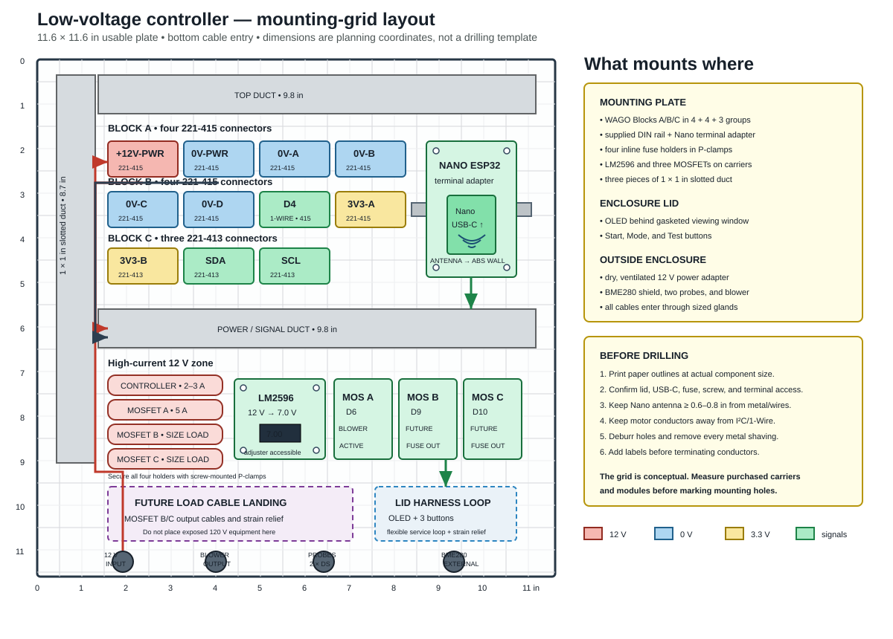

# 4. Enclosure Layout

## Selected enclosure

The selected enclosure provides approximately 11.6 × 11.6 × 4.3 inches of usable internal space, one 35 mm DIN rail, a mounting plate, and bottom cable-gland locations.

The initial low-voltage build uses the supplied rail plus panel-mounted carriers. If a DIN AC/DC supply is added later, reserve a covered mains section on the left and re-check thermal and lid clearances before drilling.

A hinged, gasketed lid and removable mounting plate are preferred.

## Internal zones

The drawing uses a half-inch planning grid over the 11.6-inch-square usable mounting plate. The numbered coordinates locate component zones; they are not drilling coordinates. Measure the actual carriers, modules, rail, and enclosure before making holes.

The suggested layout uses three pieces of nominal 1 × 1 inch slotted wiring duct: two approximately 9.8-inch horizontal pieces and one approximately 8.7-inch vertical piece. Leave extra duct uncut until the physical layout has been checked.

| Plate zone | Components |
|---|---|
| Upper left/center | WAGO Block A (4 × 221-415), Block B (4 × 221-415), and Block C (3 × 221-413) in secured panel carriers |
| Upper right | Supplied DIN rail and Nano terminal adapter, with antenna toward the ABS wall |
| Center | Horizontal duct separating distribution/control from high-current wiring |
| Lower left | Four inline fuse holders, secured with screw-mounted P-clamps |
| Lower center | LM2596 and three MOSFET modules on standoffs or purpose-built carriers |
| Lower right | Flexible service-loop landing for the lid-mounted OLED and buttons |
| Bottom edge | Separate glands for 12 V input, blower output, DS18B20 probes, and external BME280 |

The OLED and three buttons mount on the enclosure lid, not on the mounting plate. The BME280 belongs outside the enclosure in its ventilated shield. Both DS18B20 probes and the blower are also external.

The illustrated initial build retains the external ALITOVE adapter, so only protected extra-low-voltage 12 V enters the enclosure. The dashed lower-left area is reserved for a future low-voltage output branch, not exposed mains equipment.

## Single-rail use

Prioritize the supplied rail for components designed specifically for DIN mounting. The WAGO 221 carriers may instead be screwed to the removable plate to preserve rail space. Mount the LM2596 and MOSFET modules on proper standoffs or panel carriers; do not leave boards loose.

If a DIN supply is added, first arrange full-size templates for the supply, protection device, WAGO carriers, fuse holders, and Nano adapter. Add a second rail or use panel mounting rather than crowding the supplied rail or reducing required clearances.

## Placement rules

- Keep the Nano antenna end at least 15–20 mm from metal and large wiring bundles; point it toward the ABS enclosure wall.
- Keep motor wiring away from I²C and 1-Wire wiring.
- Mount the LM2596 so its adjustment screw and voltage display remain accessible.
- Mount fuses where they can be replaced without removing the controller board.
- Install each positive branch fuse after the +12 V WAGO and before its load.
- Keep the physical order shown in the drawing: Block A = `+12V-PWR`, `0V-PWR`, `0V-A`, `0V-B`; Block B = `0V-C`, `0V-D`, `D4 / 1-WIRE`, `3V3-A`; Block C = `3V3-B`, `SDA`, `SCL`.
- Leave a service loop in all wires.
- Use ferrules for stranded wires entering screw terminals.
- Use adhesive standoffs or a DIN carrier rather than loose boards.
- Mount the OLED behind a gasketed clear window or use a gasket around the display opening.
- Mount the BME280 outside the sealed box in a small louvered shield; pressure and humidity readings are not useful inside a sealed warm enclosure.

## Suggested cable glands

| Cable | Suggested gland |
|---|---|
| 16/2 blower cable | M16 |
| 12 V input cable | M16 |
| DS18B20 probe bundle | M16 or M20 |
| BME280 four-conductor cable | M12/M16 |
| Future fog trigger cable | M12/M16 |

Size glands against the actual outside diameter of the cable, not conductor gauge alone.
